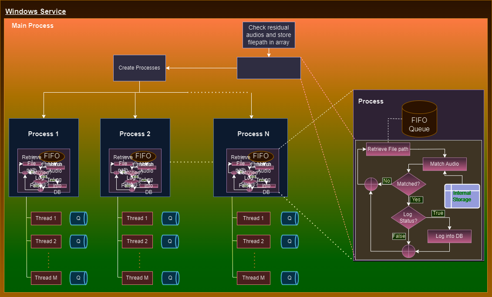

# **Advertisement Matching and Logging script**

<div align="center">
  <p>
    <a href="https://ramlaxmangroup.com/" target="_blank">
      </a>
  </p>
</div>

## <div align="left">

<details open>
<summary>Install</summary>

Install python 3 in your system. (Tested with version 3.11.2).

Create Virtual Environment for your project. [Optional]

Clone the repository and change the directory to the cloned folder in bash or command prompt.


Install all the requirements.
```bash
pip install -r requirements.txt
```

Activate Python environment if using virtual environment. [Optional]

</details>


<details open>
<summary>Run</summary>

```bash
# for windows
python main.py
# for linux and MacOs
python3 main.py
```
</details>

<details open>
<summary>Docs</summary>

All Threads continously retrieves audio buffer until finite number of iterations and writes audio clip into disk and stores location of audio file into queue.

Main process retrives the audio filepath from queue and starts the process of matching against stored audio samples.

If not matched, main process iterates above task.

If matched, checks its few validations to keep log.

If validated, keeps log otherwise main process iterates above task.

</details>
</div>
